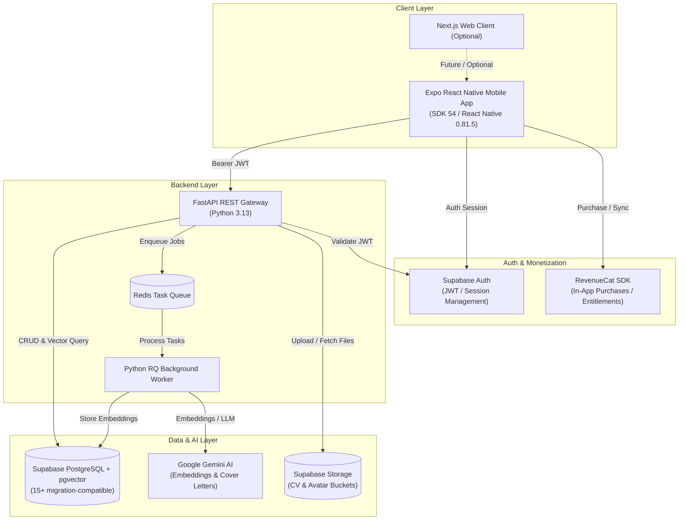

# InternMatch AI

InternMatch AI helps students discover internships that fit their skills, understand why they match, and prepare stronger applications through an AI-assisted workflow.

*Built for RevenueCat Shipaton 2026 — Standard Track.*

---

## Why InternMatch AI

Finding an internship as a student is often overwhelming, opaque, and inefficient:
- **Fragmented Discovery:** Students jump between generic job boards that lack student-specific context.
- **Opaque Qualification Fit:** Lengthy job descriptions make it difficult for applicants to know how their skills actually compare against requirements.
- **Application Fatigue:** Writing tailored cover letters for dozens of roles is exhausting, leading to generic, low-conversion submissions.
- **Lack of Actionable Feedback:** When skills do not align, students are rarely given constructive guidance on what competencies to develop.

InternMatch AI transforms this process by combining semantic matching, automated CV profile extraction, personalized skill gap analysis, and tailored application drafting into an intuitive mobile experience.

---

## What It Does

InternMatch AI delivers an end-to-end candidate copilot:

- **Authentication & Security:** Email and password sign-up, sign-in, and account confirmation powered by Supabase Auth.
- **Candidate Onboarding & Profile:** Structured profile management covering education, experience, technical skills, and portfolio projects.
- **CV Upload & Background Parsing:** Asynchronous CV parser (PDF/DOCX) that extracts structured experience and skill keywords to enrich candidate profiles.
- **Internship Catalog & Search:** Filterable directory of curated internships by work type (Remote, Hybrid, On-site), location, and required skills.
- **Saved Opportunities:** Fast bookmarking and tracking of favorite internship listings.
- **Hybrid Semantic & Skill Matching:** Real-time match scoring combining exact/fuzzy skill overlap with pgvector semantic similarity.
- **"Why You Match" Intelligence:** Interactive compatibility breakdown detailing matching skills, missing requirements, and targeted learning recommendations.
- **AI Cover Letter Drafting:** Context-aware, tone-customizable application drafts generated using Gemini AI.
- **Application Tracking:** Visual status timeline tracking progress across Applied, Interviewing, and Accepted stages.
- **Multilingual UI:** Complete internationalization in English (`en`), Turkish (`tr`), and Arabic (`ar`) with dynamic RTL layout support.
- **RevenueCat In-App Purchases:** Candidate monetization tier (**Pro Student**) featuring native RevenueCat Test Store subscription management, dynamic pricing, and `CustomerInfo`-driven entitlement updates.

> [!NOTE]
> **Employer Scope:** Candidate discovery, matching, and application workflows are fully functional. Employer workspace tools (job posting and applicant management) are currently presented in role-aware preview mode.

---

## Current Product & Trust Surface

InternMatch AI now spans the complete candidate, employer, and trust workflow:

- **Candidate experience:** internship discovery, profile and CV workflows, explainable matching, application preparation, application tracking, interview preparation, saved opportunities, and subscription-aware AI usage.
- **Employer experience:** organization workspace, opportunity creation, candidate review, interview workflow, employer AI tools, and subscription-aware limits.
- **Admin Trust Console:** administrative review tools for users, employer organizations, opportunity moderation, and trust/compliance workflows.
- **Employer organization verification:** identity verification is reviewed independently from employer compliance evidence.
- **Listing moderation:** employer opportunities use a review lifecycle before public publication; organization verification does not automatically publish a listing.
- **Notifications:** event-driven mobile notification infrastructure supports product and workflow events.
- **Privacy and account control:** in-app Privacy Policy, Terms of Use, support contact, recent re-authentication for sensitive deletion, and permanent account deletion workflows.
- **Public product site:** `https://internmatch.college`
- **Production API:** `https://api.internmatch.college`

### Shipaton 2026 release target

The current submission target is the **RevenueCat Shipaton 2026 Standard Track**. Test Store and sandbox evidence remain useful development evidence, but the final submission path targets publicly distributed iOS and Android builds and production-store RevenueCat purchase validation.

## RevenueCat Integration

Monetization in InternMatch AI is built natively with the **RevenueCat React Native SDK (`react-native-purchases` 10.7.2)**:

```
┌────────────────────────────────────────────────────────┐
│                   Mobile Client                        │
│          RevenueCatProvider + PlansScreen              │
└────────────┬───────────────────────────────┬───────────┘
             │                               │
    1. Bind App User ID            2. Purchases.purchasePackage()
             │                               │
             v                               v
┌─────────────────────────┐     ┌─────────────────────────┐
│      Supabase Auth      │     │    RevenueCat Engine    │
│  User Session (UUID)    │     │   Test Store / Receipts │
└─────────────────────────┘     └────────────┬────────────┘
                                             │
                                   3. CustomerInfo.entitlements
                                             │
                                             v
                                ┌─────────────────────────┐
                                │   pro_student Active    │
                                │   Candidate Plan State  │
                                └─────────────────────────┘
```

### Key Integration Highlights
- **Canonical Product Contract:**
  - **Entitlement ID:** `pro_student`
  - **Offering ID:** `default`
  - **Monthly Package ID:** `$rc_monthly`
  - **Product ID:** `internmatch_pro_student_monthly`
- **Zero Local Trust:** Subscription state is derived strictly from RevenueCat-provided `CustomerInfo.entitlements.active['pro_student']`. No local flags or unverified storage values dictate subscription status.
- **Identity-Bound Lifecycle:** The RevenueCat App User ID is synchronized to the authenticated Supabase user UUID (`session.user.id`). Identity transitions are guarded with generation counters to prevent cross-user state leaks.
- **Dynamic Pricing:** Plans Screen dynamically renders localized store package pricing (`pkg.product.priceString`) loaded at runtime from RevenueCat.
- **Graceful Error Handling:** User cancellations (`PURCHASE_CANCELLED_ERROR`) are handled quietly without jarring error dialogs.
- **Test Store Workflow:** The hackathon demonstration runs natively on the RevenueCat Test Store sandbox with zero merchant account or store console dependencies.

---

## Architecture Overview



---

## Technology Stack

| Domain | Technologies |
|---|---|
| **Mobile Client** | React Native 0.81.5, Expo SDK 54, TypeScript, React Navigation, Expo Haptics, Expo Localization |
| **Monetization** | RevenueCat React Native SDK (`react-native-purchases` 10.7.2), RevenueCat Test Store |
| **Authentication** | Supabase Auth (`@supabase/supabase-js` 2.45.0), Bearer JWT Validation |
| **Backend API** | Python 3.13, FastAPI 0.115, Pydantic v2, SQLAlchemy 2.0, Uvicorn |
| **Background Processing** | Redis 7, Python RQ (Redis Queue), RapidFuzz (Skill Match) |
| **Database & Vector Search** | Supabase PostgreSQL (`15+` migration compatibility), local PostgreSQL 17 Docker reference, `pgvector` (1536-dim embeddings), Row-Level Security (RLS) |
| **AI & LLM Services** | Google Gemini (`gemini-3.5-flash`, `gemini-embedding-2`) via `google-genai` SDK |
| **Web Frontend (Optional)** | Next.js 14, React 18, Tailwind CSS |
| **Infrastructure & CI** | Docker, Docker Compose, GitHub Actions, EAS Build |

---

## Repository Structure

```
.
├── apps/
│   ├── mobile/             # React Native / Expo mobile application
│   └── landing/            # Next.js marketing landing page (optional)
├── backend/                # FastAPI application, routers, services, and models
├── database/               # SQL migrations, RLS policies, and seed data
│   ├── migrations/         # Numbered schema migrations (001–010)
│   └── seeds/              # Demo dataset scripts
├── docs/                   # System documentation, architecture, and security
├── scripts/                # Database seeding and management utilities
├── tests/                  # Automated pytest test suite (518+ unit, integration, and security tests)
├── worker/                 # RQ worker tasks (CV parsing, match calculation, cover letters)
├── docker-compose.yml      # Local container orchestration
└── JUDGE_RUNBOOK.md        # Comprehensive judge reproduction guide
```

---

## Quick Start

For detailed step-by-step instructions, refer to the **[Judge Reproduction Runbook](JUDGE_RUNBOOK.md)**.

### 1. Start Backend Services
```bash
# Copy root environment template
cp .env.example .env

# Launch backend, worker, redis, and database in Docker
docker compose up --build -d

# Verify API health
curl http://localhost:8000/health
```

### 2. Start Mobile Development Client
```bash
cd apps/mobile

# Copy mobile environment template
cp .env.example .env

# Install dependencies
npm ci

# Run on Android Emulator with native development client (required for RevenueCat)
npx expo run:android
```

---

## Environment Variables

| Scope | File | Description |
|---|---|---|
| **Server & Worker** | `.env` | **Server-only secrets.** Contains database connection string, Supabase service role key, Gemini API key, and Redis configuration. |
| **Mobile Client** | `apps/mobile/.env` | **Client-safe configuration.** Contains public Supabase URL, publishable key, backend API URL, and public RevenueCat API key. |

> [!WARNING]
> All variables prefixed with `EXPO_PUBLIC_*` are bundled into the client binary and are publicly accessible. Never place private keys or service role secrets in `apps/mobile/.env`.

---

## Automated Testing & Quality

Run the test suite and static analysis tools:

```bash
# Run backend pytest suite
python -m pytest

# Run Python linter & code formatting check
python -m ruff check backend/app worker tests --output-format=concise

# Run mobile TypeScript typecheck
cd apps/mobile && npx tsc --noEmit
```

---

## Security

InternMatch AI follows a security-by-design model:
- Row-Level Security (RLS) on all twelve application-owned public tables after migrations `001` through `010`; policies vary by table role.
- Bearer JWT token verification on all protected endpoints.
- Client-side subscription authority powered by RevenueCat CustomerInfo entitlements.
- Sanitized public environment templates with zero tracked credentials.

For full vulnerability management and security architecture details, see **[docs/SECURITY.md](docs/SECURITY.md)**.

---

## Documentation Index

- **[Judge Reproduction Runbook](JUDGE_RUNBOOK.md)** — Step-by-step evaluator instructions
- **[Shipaton 2026 Submission](docs/SHIPATON_2026_SUBMISSION.md)** — Video storyboard and project narrative
- **[System Architecture](docs/ARCHITECTURE.md)** — Deep technical specification
- **[API Contract](docs/API_CONTRACT.md)** — REST endpoint definitions and schemas
- **[Database Schema](docs/DATABASE.md)** — Relational structure, RLS, and vector indexing
- **[Security Policy](docs/SECURITY.md)** — Security controls and threat model
- **[Development Guide](docs/DEVELOPMENT.md)** — Contributor guidelines and workflow
- **[Deployment Runbook](docs/DEPLOYMENT.md)** — Deployment models and infrastructure specifications

---

## Team & Authors

InternMatch AI is independently created and developed by a collaborative two-person student team:
- **Selanur Yurdakul** — Originated the InternMatch AI product concept; led the initial frontend foundation, mobile screen layouts, visual identity, and UI/UX design.
- **Mohamad Barakat** — Led system architecture, backend engineering, database/vector systems, background processing, and technical integration; contributed substantially to mobile frontend features, integration, and final UI/UX polish.

Both team members are Software / Computer Engineering students at Üsküdar University and jointly shaped, tested, and finalized the complete product experience.

*Academic & Club Context:* **AISS Club — Üsküdar University** *(Mohamad Barakat serves as President and Selanur Yurdakul as Vice President of AISS — Artificial Intelligence and Intelligent Systems Club at Üsküdar University. This affiliation represents academic and student-club context only. InternMatch AI is an independent student project; it is NOT an official AISS Club or Üsküdar University project, and neither institution provided financial, technical, development, or material support).*

---

## License

This project is licensed under the **[MIT License](LICENSE)**.
