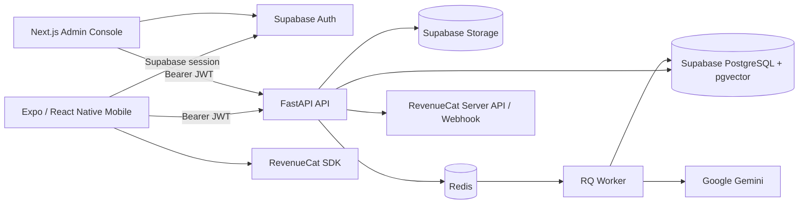

# InternMatch AI

InternMatch AI is a multilingual internship platform that connects **students**, **employers**, and an **administrative trust layer** in one end-to-end workflow. It combines structured candidate profiles, explainable hybrid matching, AI-assisted application preparation, employer recruiting tools, moderated opportunity publishing, and RevenueCat-backed subscription surfaces.

**Release documentation checkpoint:** 2026-09-24
**Source release commit:** `707601d93294c891d53b900d01c644200f27292b`

> Release status is intentionally separated from product capability. At this checkpoint iOS version `1.0.0` Build 9 is associated with App Review, while Build 10 was built from the release commit and uploaded to App Store Connect / TestFlight for validation. TestFlight is not a public App Store release. Public iOS/Android store URLs must be verified separately before a final Standard Track submission.

## Why InternMatch AI

Students often have to infer fit from long job descriptions, repeatedly rewrite application materials, and receive little actionable guidance about skill gaps. Employers need a structured way to publish internships, review candidates, and manage interviews without sacrificing trust controls. InternMatch AI addresses both sides while keeping publication and verification decisions server-controlled.

## Product Surfaces

### Student / Candidate

- Email/password authentication, email confirmation, recovery, Google OAuth, and Sign in with Apple on iOS.
- Structured profile covering skills, education, experience, projects, and preferences.
- Private CV upload with asynchronous parsing and profile extraction.
- Internship discovery with work-type filtering and saved opportunities.
- Hybrid matching that combines exact/fuzzy skill overlap, semantic similarity, and profile preferences.
- **Why You Match** explanations, matching/missing skills, and skill-gap guidance.
- AI-assisted cover-letter drafting and interview preparation.
- Application tracking across `saved`, `applied`, `interviewing`, `accepted`, and `rejected` states.
- Durable in-app notifications plus Expo push-device registration and push delivery.
- English, Turkish, and Arabic localization, including RTL layout for Arabic.
- Student Pro functionality with backend-controlled AI usage allowances.
- Account/privacy controls including recent reauthentication before permanent account deletion.

### Employer

- Role-aware employer account flow using email/password authentication.
- Organization workspace with business identity and representative details.
- Organization verification workflow separated from compliance-evidence review.
- Opportunity creation and owned-listing management.
- Applicant review, candidate context, status transitions, CV access through authenticated server boundaries, and interview scheduling.
- Employer candidate insight with separately enforced AI usage quotas.
- Employer Pro tools for interview kits, shortlist comparison, AI-assisted internship-description drafting, pipeline analytics, and multiple published listings.
- Employer Free supports one published internship at a time; subscription/product policy is enforced by the backend.
- Mandatory listing moderation before employer-generated opportunities become public.

### Admin Trust & Safety Console

- Backend-enforced admin authorization.
- Employer organization review.
- Employer compliance-evidence review as a separate trust domain.
- Internship moderation with approval and request-changes workflows.
- User directory/search with student/employer context and administrative audit history.
- Admin-managed opportunity and applicant workflows where applicable.

## Listing Moderation Lifecycle

Employer organization verification does **not** automatically publish an opportunity. Employer-generated listings move through an explicit moderation lifecycle:

```text
Employer create / edit
        |
        v
   under_review  ---- Admin approves ----> published
        |
        +---- Admin requests changes ----> draft
                                            |
                                            +--> owner-visible feedback
                                            +--> existing fields prefilled
                                            +--> employer edits and resubmits
                                            v
                                       under_review
```

`employer_visible_feedback` is owner-only. It is not part of the public internship response, and previous feedback is cleared after a successful employer resubmission.

## Matching & AI Architecture

InternMatch AI keeps deterministic scoring separate from generative explanation:

- Exact and fuzzy skill matching with configurable fuzzy threshold.
- Semantic similarity using Gemini embeddings persisted in PostgreSQL with `pgvector`.
- Candidate preference contribution for work type/location where applicable.
- Server-side Gemini workflows for CV extraction, match explanations, cover-letter drafting, and interview preparation.
- Redis + RQ for asynchronous processing where the workflow is background-oriented.
- Backend-controlled AI quotas and idempotency protections.

The persisted match score is computed by application logic; generative AI explains the result but does not autonomously decide who should be hired.

## RevenueCat Monetization

InternMatch AI uses `react-native-purchases` `10.7.2` and supports both student and employer subscription contracts.

| Audience | Entitlement | Offering | Package | Canonical Product |
|---|---|---|---|---|
| Student | `pro_student` | `default` | `$rc_monthly` | `internmatch_pro_student_monthly` |
| Employer | `pro_employer` | `employer_default` | `$rc_monthly` | `internmatch_pro_employer_monthly` |

The mobile SDK resolves store packages dynamically. Development can use a RevenueCat Test Store public key, while release builds use platform-specific public SDK keys for iOS and Android.

Subscription authority is not client-only. The backend exposes authenticated subscription state and reconciliation, and it processes authenticated RevenueCat lifecycle webhooks:

- `GET /api/v1/me/subscription`
- `POST /api/v1/me/subscription/reconcile`
- `POST /api/v1/webhooks/revenuecat`

The server-side RevenueCat secret is never a mobile credential. Webhook Bearer authentication is enforced by the configured server contract; HMAC signature/timestamp verification additionally applies when a signing secret is configured.

> The custom mobile promo-code UI that directly unlocked Pro was removed from the current store application. Backend/admin promo source still exists in the repository, but migration `028_promo_campaigns.sql` is not part of the current production-applied release baseline.

## Architecture Overview



For faithful full-stack development, the application depends on Supabase-managed Auth and Storage in addition to PostgreSQL. The plain `pgvector` PostgreSQL container in `docker-compose.yml` is useful for isolated development/testing scenarios, but it is not a complete replacement for a Supabase project because the full schema references resources such as `auth.users`.

## Technology Stack

| Domain | Current Stack |
|---|---|
| Mobile | Expo SDK 54, React Native 0.81.5, React 19.1, TypeScript ~5.9, React Navigation |
| Admin | Next.js 15.5.x, React 18, TypeScript |
| Authentication | Supabase Auth / JWT |
| Backend | FastAPI, Python 3.13 CI reference runtime, SQLAlchemy, Pydantic |
| Data | Supabase PostgreSQL, `pgvector`, Supabase Storage |
| Async | Redis 7, RQ worker |
| AI | Google Gemini (`LLM_MODEL_NAME` / `EMBEDDING_MODEL_NAME` configured server-side) |
| Monetization | RevenueCat React Native SDK + backend reconciliation/webhook integration |
| CI / Release | GitHub Actions, Docker / Docker Compose, EAS Build |

## Repository Structure

```text
.
├── apps/
│   ├── admin/              # Next.js Trust & Safety Console
│   ├── landing/            # Product/marketing web surface
│   └── mobile/             # Expo / React Native student + employer app
├── backend/                # FastAPI API, repositories, services, security
├── database/               # Migrations, seeds, storage setup
├── docs/                   # Architecture, security, API, database, runbooks
├── scripts/                # Development/maintenance utilities
├── tests/                  # Pytest and source-contract coverage
├── worker/                 # RQ background tasks
└── docker-compose.yml      # Optional local container orchestration
```

Migration source currently spans `001` through `028`. The release execution baseline is through `027`; migration `028_promo_campaigns.sql` exists in source but is not part of the current production-applied baseline and must not be blindly applied.

## Development Quick Start

Use a **development Supabase project** for faithful full-stack reproduction. Do not use production as a development or test environment.

```bash
cp .env.example .env

docker compose up --build -d
```

`docker-compose.yml` provides backend, worker, Redis, and a local `pgvector` PostgreSQL service. The full application schema, however, depends on Supabase Auth/Storage; point server Supabase credentials and `DATABASE_URL` to a development Supabase project when reproducing the complete product.

For the mobile application:

```bash
cd apps/mobile
cp .env.example .env
npm ci
npx expo run:android
```

Expo Go is not sufficient for native RevenueCat functionality. On macOS, native iOS development can use `npx expo run:ios`.

## Environment & Secret Boundaries

- Root `.env`: server-only configuration and secrets.
- `apps/mobile/.env`: public client configuration (`EXPO_PUBLIC_*` is readable in the client bundle).
- `apps/admin/.env.local`: public Admin client configuration; backend admin authorization is still server-enforced.
- Never place Supabase service-role credentials, RevenueCat server secrets, webhook secrets, database passwords, or Apple private keys in mobile/admin public environment variables.

## Automated Quality Checks

CI uses Python `3.13` and Node.js `22` as reference runtimes.

```bash
python -m pytest
python -m ruff check backend/app worker tests --output-format=concise

cd apps/mobile
npx tsc --noEmit

cd ../admin
npm ci
npm run typecheck
```

## Production API Policy

- Root liveness: `GET /health`
- Versioned readiness: `GET /api/v1/health` (database + Redis + RQ worker; returns HTTP 503 if a required dependency is unavailable)
- Swagger UI, ReDoc, and `/openapi.json` are intentionally disabled when `ENVIRONMENT=production`.

## Documentation

- [Shipaton 2026 Submission](docs/SHIPATON_2026_SUBMISSION.md)
- [Judge Runbook](docs/JUDGE_RUNBOOK.md)
- [System Architecture](docs/ARCHITECTURE.md)
- [API Contract](docs/API_CONTRACT.md)
- [Database](docs/DATABASE.md)
- [Security](docs/SECURITY.md)
- [Development](docs/DEVELOPMENT.md)
- [Deployment](docs/DEPLOYMENT.md)

## Team

InternMatch AI was conceived and developed by a collaborative two-person student team: **Mohamad Barakat** and **Selanur Yurdakul**, Software / Computer Engineering students at Üsküdar University. Selanur originated the product vision; Mohamad established the technical architecture and engineering foundation; together they designed, implemented, tested, and refined the product.

## License

Licensed under the [MIT License](LICENSE).
