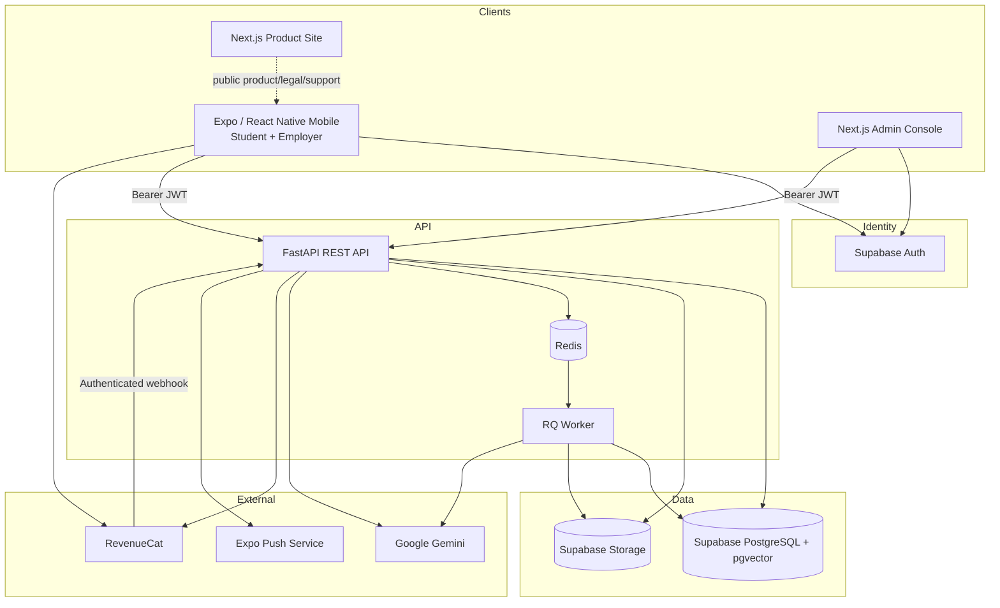

# InternMatch AI — System Architecture

**Documentation checkpoint:** 2026-09-24
**Authoritative release source:** `707601d93294c891d53b900d01c644200f27292b`

## 1. Purpose and Product Boundaries

InternMatch AI is a three-surface internship platform:

1. **Student / Candidate mobile experience** — profile/CV intelligence, discovery, explainable matching, application preparation and tracking.
2. **Employer mobile experience** — organization identity, opportunities, applicants, interviews, and subscription-aware recruiting tools.
3. **Admin Trust & Safety Console** — organization review, compliance-evidence review, listing moderation, user/audit visibility, and admin-managed opportunity workflows.

The backend is the authority for identity-derived ownership, role enforcement, publication state, quotas, subscription state, and trust transitions. The mobile/Admin clients render those states but do not grant themselves authority.

## 2. Topology



The public product site is `https://internmatch.college`; the production API origin is `https://api.internmatch.college`.

## 3. Client Architecture

### 3.1 Mobile

Current mobile baseline:

- Expo SDK `54`
- React Native `0.81.5`
- React `19.1.0`
- TypeScript `~5.9`
- React Navigation
- Supabase JS `^2.45.0`
- `react-native-purchases` `10.7.2`
- `expo-notifications`
- `expo-apple-authentication`
- `expo-web-browser`

The application is role-aware. Candidate and employer accounts share authentication/session infrastructure, while backend role dependencies decide which protected domain endpoints each role may use.

Candidate social authentication is intentionally asymmetric:

- Google uses Supabase OAuth through the browser auth session flow.
- Sign in with Apple uses the native iOS Apple authentication integration.
- Employer account creation/sign-in uses the email/password workflow; the candidate Google/Apple social signup path is not an employer signup path.

### 3.2 Admin Console

The Admin Console is a Next.js `15.5.x` / React 18 application. Public client environment variables configure Supabase and API origins, but authorization is not a client-side property. Admin API operations require an authenticated identity accepted by the backend `require_admin_user` / `ADMIN_USER_IDS` boundary.

Implemented Admin surfaces include organization reviews, internship listings/moderation, compliance reviews, and the user directory/audit timeline. Promo administration code also exists in source; its migration is separately controlled by the release migration baseline.

## 4. Authentication and Role Authority

Supabase Auth proves external identity. The backend then provisions the canonical InternMatch account via authenticated application routes and persists the role (`intern` or `employer`) in the InternMatch profile state.

Key rules:

- Protected endpoints derive the user from the verified Bearer JWT; clients do not choose another user ID to act as.
- Account role is persisted by the backend and is not treated as an arbitrary editable profile preference after provisioning.
- Employer-only routes use employer authorization dependencies.
- Admin-only routes use backend admin authorization.
- Permanent account deletion requires recent reauthentication; Apple-linked deletion also enforces the Apple revocation boundary when applicable.

## 5. Student Data & CV Pipeline

Candidate profile data is structured across student profile, skills, education, experience, projects, and preferences.

CV flow:

```text
Mobile selects CV
  -> POST /api/v1/profile/cv
  -> validate type/size/signature + ownership
  -> private Supabase Storage
  -> durable processing job
  -> Redis/RQ
  -> CV validation/extraction
  -> structured candidate profile writes
  -> candidate embedding refresh / match invalidation as required
```

The upload endpoint supports idempotency and product quota integration. Storage object paths remain server-managed.

For faithful full-stack development, CV storage is a private development-Supabase bucket configured through `CV_STORAGE_BUCKET` (default template `cvs`).

## 6. Hybrid Matching Engine

The matching engine deliberately separates deterministic scoring from generative explanation.

### 6.1 Score Composition

The MVP scoring policy is:

```text
overall = 0.50 * skill_score
        + 0.30 * vector_score
        + 0.20 * attribute_score
```

**Skill score** combines required and preferred skill coverage. When both groups exist, the established policy weights required skills more heavily (`70%` required / `30%` preferred). Exact normalized skill matches are accepted first; fuzzy matching then uses the configured `SKILL_FUZZY_THRESHOLD` (template default `85`).

**Vector score** uses semantic similarity between the candidate summary embedding and internship description embedding. Embedding dimension is configured server-side (`1536` in the current template) and persisted through `pgvector`.

**Attribute score** incorporates supported candidate preferences such as desired work types and locations. These preferences are soft scoring inputs, not an eligibility oracle.

Scores are computed by deterministic application logic and persisted with match records. Gemini does not assign the authoritative numeric score.

### 6.2 Candidate Embedding Context

The candidate summary embedding is built from deterministic application-owned profile context such as:

- headline
- skills
- education
- experience
- projects
- relevant matching preferences (`work_types`, `desired_locations`, `target_roles`)

It excludes internal IDs, storage paths, timestamps, previously generated match scores/explanations, and arbitrary unknown preference keys.

### 6.3 Recalculation Semantics

A recalculation updates overlapping matches, removes stale matches that are no longer in the candidate's current result set, invalidates stale generated explanations, and refreshes deterministic skill-gap state. Employer-facing ranking logic fails closed while a candidate's authoritative match recalculation is actively queued/processing so stale scores are not presented as current.

## 7. Generative AI Boundaries

Google Gemini is used for source-verified workflows including CV interpretation/extraction, generated match explanation, application drafting, and interview preparation. Model names are server configuration (`LLM_MODEL_NAME`, `EMBEDDING_MODEL_NAME`) rather than client authority.

Generative output is bounded by server-owned context and product quota controls. In particular:

- match scoring is deterministic; generated text explains it
- candidate ownership is resolved from authentication
- AI usage is counted/limited by backend policy
- idempotency guards prevent repeated requests from silently consuming inconsistent operations

## 8. Asynchronous Processing

Redis + RQ provide durable background execution for workflows that should not block mobile requests, including CV processing and match/application jobs where implemented.

`processing_jobs` tracks ownership and lifecycle (`queued`, `processing`, `completed`, `failed`, with progress metadata added by later migration). `GET /api/v1/jobs/{job_id}` is owner-scoped; job cancellation support exists for cancellable processing.

The versioned readiness endpoint checks that at least one RQ worker is present in addition to database and Redis connectivity.

## 9. Internship Provenance and Publication

Internships can come from controlled/admin-curated sources or employer ownership. Provenance and ownership are persisted so recruiter actions cannot cross ownership boundaries.

Employer-generated listings require a currently verified employer organization and are subject to listing-capacity policy. Creation results in administrative review rather than automatic public publication.

Canonical employer lifecycle:

```text
under_review -> published       (Admin approval)
under_review -> draft           (Admin request changes)
draft        -> under_review    (Employer edit + resubmit)
published    -> closed          (close lifecycle)
```

When Admin requests changes, explicit employer-visible feedback is persisted. The owner detail response may expose it to the owning employer, while public internship responses do not. A successful resubmission clears the previous review feedback.

## 10. Employer Organization Verification

Organization verification is a separate authority from compliance evidence.

Employer organization data includes legal/display names, website, business email, country, optional registration/tax values, and representative information. Verification lifecycle includes `unverified`, `pending`, `verified`, `rejected`, and `suspended`.

Employer organization changes and review transitions are recorded as administrative events. Verification means the organization passed the platform's review workflow; it is not a legal certification and does not bypass listing moderation.

## 11. Compliance Evidence Architecture

Compliance claims are jurisdiction- and scope-specific and intentionally independent from organization identity verification.

Claim states include `draft`, `pending`, `approved`, `rejected`, `revoked`, and `expired`. Supporting evidence is stored in a private `employer-compliance-evidence` bucket provisioned by migration `025`. There are intentionally no direct anonymous/authenticated storage policies for that bucket; trusted backend authorization mediates access.

An approved claim means only that its specific evidence was reviewed for the recorded jurisdiction and scope. It does not certify general legal compliance.

## 12. Applications, Applicants, and Interviews

Candidate application state uses:

```text
saved -> applied -> interviewing -> accepted / rejected
```

The exact valid transitions are server-enforced. Candidate-managed operations cannot impersonate employer-controlled status changes. Employers can review applicants only for opportunities they own. Admin recruiter operations are separately restricted to admin-managed listings.

Private candidate CV access is streamed through authenticated server endpoints. Storage paths/provider URLs are not returned as recruiter-facing authority, and sensitive document responses use defensive cache/security headers.

Employer product tooling is backend-gated rather than client-trusted. Candidate insight remains available on Employer Free subject to its separate AI quota. Employer Pro unlocks interview-kit generation, shortlist comparison, the editable internship-description assistant, pipeline analytics, and multiple published listings. Shortlist comparison is decision support and does not replace the human hiring decision.

## 13. Notifications

Migration `027` adds durable notification infrastructure. The API includes:

- authenticated notification inbox/listing
- unread count
- mark read/unread/read-all
- per-notification deletion
- Expo push-device registration/disable
- opportunity-alert preference

Product events can create candidate, employer, or admin notifications for workflows such as application transitions, opportunity moderation, organization verification, and compliance review. Push delivery is supplemental to durable notification state; no zero-latency guarantee is assumed.

## 14. RevenueCat Subscription Architecture

### 14.1 Mobile Contracts

| Audience | Entitlement | Offering | Package | Canonical product |
|---|---|---|---|---|
| Student | `pro_student` | `default` | `$rc_monthly` | `internmatch_pro_student_monthly` |
| Employer | `pro_employer` | `employer_default` | `$rc_monthly` | `internmatch_pro_employer_monthly` |

Mobile identifies RevenueCat with the authenticated Supabase user UUID. Packages and visible prices are resolved from RevenueCat/store metadata rather than hard-coded prices.

A development Test Store public key may be used only in development. Release builds select platform-specific iOS/Android public SDK keys and reject Test Store keys in the production-key path.

### 14.2 Backend Authority

The backend exposes:

- `GET /api/v1/me/subscription`
- `GET /api/v1/me/ai-usage`
- `POST /api/v1/me/subscription/reconcile`
- `POST /api/v1/webhooks/revenuecat`

The server persists authoritative subscription state, reconciles with RevenueCat's server API, and processes lifecycle webhook events. Webhook delivery is authenticated with the configured Bearer token; HMAC signature/timestamp verification additionally applies when a signing secret is configured. Webhook processing is designed to be idempotent.

The custom mobile promo-code UI that directly granted Pro is not part of the current store app. Promo backend/admin source remains, but migration `028_promo_campaigns.sql` is outside the current production-applied release baseline.

## 15. Storage Boundaries

| Data | Bucket / boundary | Access model |
|---|---|---|
| Candidate CV | `CV_STORAGE_BUCKET` (template `cvs`) | private; backend-mediated |
| Avatar | `avatars` | private; provisioned by `database/supabase_storage_setup.sql`; backend-mediated |
| Employer compliance evidence | `employer-compliance-evidence` | private; migration `025`; backend/admin authorization |

The API returns opaque/product-owned references where appropriate rather than exposing raw storage paths.

## 16. Database & Supabase Boundary

The repository includes a local `pgvector/pgvector` PostgreSQL container for optional isolated development/testing. It is **not** a full local Supabase replacement. The full migration chain references `auth.users` and depends on Supabase Auth/Storage boundaries.

For faithful full-stack development reproduction use a development Supabase project for PostgreSQL, Auth, and Storage. Never use production as a test environment.

Migration source spans `001` through `028`; the release execution baseline is through `027`. Migration `028_promo_campaigns.sql` exists in source but is not part of the current production-applied baseline.

## 17. Security & Observability

FastAPI adds request correlation IDs and baseline defensive headers. Production adds HSTS and intentionally disables Swagger UI, ReDoc, and OpenAPI JSON. Protected document browser requests use a generic non-sensitive unavailable-document destination for inaccessible resources.

Authorization rules are enforced at server boundaries:

- JWT-derived identity
- tenant/owner checks
- employer role checks
- admin allow-list checks
- private-storage ownership checks
- backend subscription/quota authority
- recent reauthentication before permanent deletion

See [SECURITY.md](SECURITY.md) for the detailed security model.

## 18. Localization

The mobile UI supports English (`en`), Turkish (`tr`), and Arabic (`ar`) with RTL layout for Arabic. UI locale and generated-content locale are related but distinct: supported AI endpoints accept explicit content locale parameters/fields where required, while the client owns screen localization.

## 19. Release Topology

Current repository release tooling includes EAS profiles for development, preview, and production. Production uses `environment: production`, `autoIncrement: true`, Android `app-bundle`, `APP_VARIANT=production`, and remote app-version source.

At the 2026-09-24 checkpoint, Build 9 is associated with App Review and Build 10 (from the release commit) is uploaded to App Store Connect/TestFlight for validation. This architecture statement does not claim public store approval.

## 20. Related Documentation

- [Judge Runbook](JUDGE_RUNBOOK.md)
- [Shipaton Submission](SHIPATON_2026_SUBMISSION.md)
- [Security](SECURITY.md)
- [API Contract](API_CONTRACT.md)
- [Database](DATABASE.md)
- [Development](DEVELOPMENT.md)
- [Deployment](DEPLOYMENT.md)
