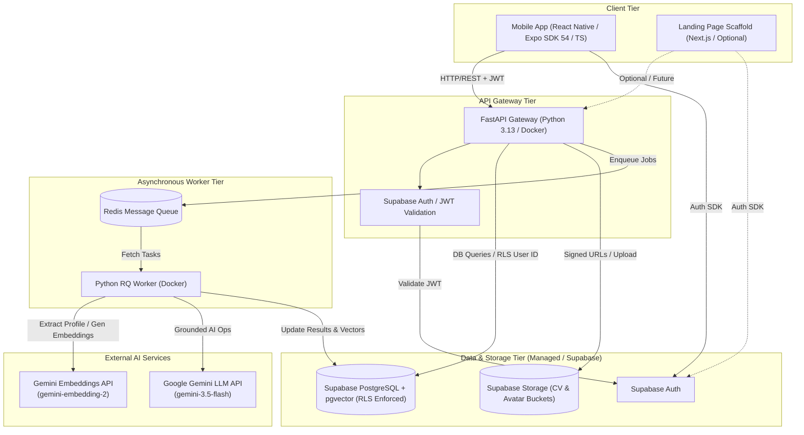
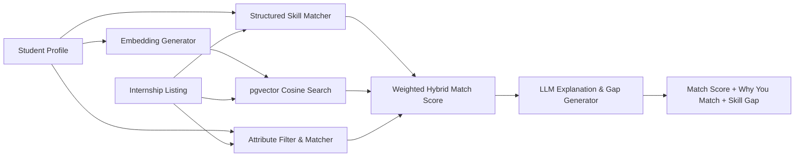
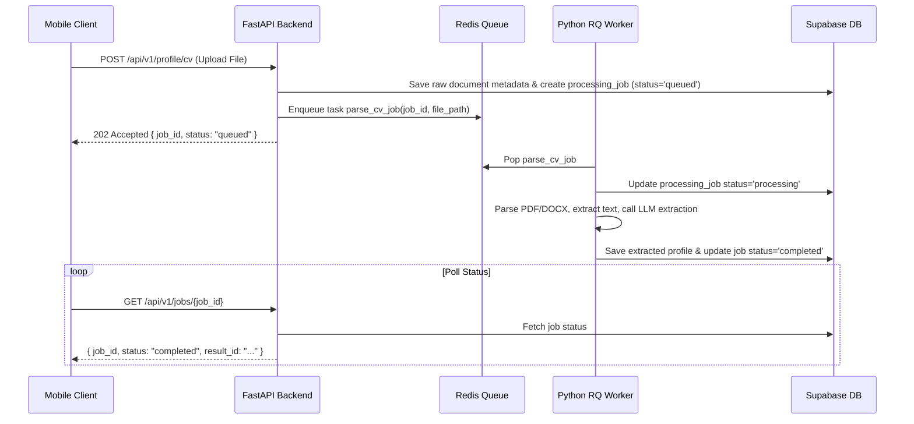

# InternMatch AI — System Architecture Document

**Version:** 1.0.0  
**Status:** Approved & Authoritative  
**Target Runtimes:** Python 3.13 (Backend/Worker), Node.js 22 LTS (Mobile/Landing; CI reference runtime)

**Authors:** Mohamad Barakat & Selanur Yurdakul (Two-Person Student Team, Affiliation: AISS Club — Üsküdar University)

---

## 1. Executive Summary & Product Vision

**InternMatch AI** is a production-minded, AI-powered personalized internship matching and application assistant designed for students and early-career candidates.

### Core User Journey
```
[CV Upload] 
   └──> [AI Profile Extraction] 
           └──> [Internship Matching] 
                   ├──> [Match Score (Deterministic + Vector Similarity)]
                   ├──> [Why You Match (LLM Grounded Explanation)]
                   ├──> [Skill Gap Analysis]
                   └──> [Personalized Application Generation] 
                           └──> [Application Tracker]
```

---

## 2. Team Ownership, Collaboration Model & Academic Context

### 2.1 Project Origin, Academic Context & Non-Institutional Boundary
The original product concept and vision for **InternMatch AI** were proposed by **Selanur Yurdakul**. Following the initial concept, **Mohamad Barakat** established the system architecture, engineering rules, technical documentation, API contracts, backend/frontend boundaries, and implementation foundation. The final application was collaboratively developed, integrated, and refined by both team members.

Both team members are **Software / Computer Engineering** students at **Üsküdar University** and serve in student leadership roles in **AISS** (Artificial Intelligence and Intelligent Systems Club), with Mohamad Barakat as President and Selanur Yurdakul as Vice President.

**Strict Independent Student Boundary:**
InternMatch AI is an independent student project created and developed directly by Mohamad Barakat and Selanur Yurdakul as a two-person team. It is **NOT** an official AISS Club project, is **NOT** an Üsküdar University project, and is **NOT** submitted on behalf of either institution. Neither AISS Club nor Üsküdar University provided financial support, technical support, development support, institutional project support, or material project support. Academic and club affiliations are stated solely as truthful academic and student-club context relevant to student-track eligibility.

```
InternMatch AI
    ↓
Collaborative Two-Person Student Team
    ├── Mohamad Barakat (Software/Computer Eng Student; AISS President)
    └── Selanur Yurdakul (Software/Computer Eng Student; AISS Vice President)
          ↓
Academic & Student-Club Context (Student Context Only; Zero Institutional Support):
AISS Club — Üsküdar University
```

### 2.2 Primary Contributions & Joint Governance

| Area | Lead / Primary Scope | Detailed Contributions |
| :--- | :--- | :--- |
| **Product Concept & Visual Direction** | **Selanur Yurdakul** | Original InternMatch AI product idea, initial frontend foundation, mobile screen layouts, UI/UX design, interaction concepts, and brand visual identity. |
| **Architecture, Backend & Systems** | **Mohamad Barakat** | System architecture, FastAPI REST gateway (Python 3.13), database design, PostgreSQL/pgvector, Supabase integration, security/JWT verification, Redis/RQ worker queue, Docker runtimes, Python quality/Ruff, API contracts, end-to-end system integration, substantial mobile frontend implementation, and final UI/UX polish (visual consistency, headers, hero areas, colors). |
| **Joint Responsibilities** | **Mohamad Barakat & Selanur Yurdakul** | Product decisions, feature refinement, application testing, quality review, hackathon strategy, demo video planning, submission preparation, and project presentation. |

**Boundary Principle:** The frontend mobile application and backend API services are decoupled and independently testable across the authoritative API contract (`docs/API_CONTRACT.md`).

---

## 3. High-Level Architecture Topology



---

## 4. Technology Stack & Component Specifications

### 4.1 Frontend Tier
- **Mobile Application:** React Native built with Expo SDK 54 (TypeScript). Operates in a standard, uncontainerized Expo development environment.
- **Landing Page (Optional):** Next.js (TypeScript) web scaffold. Serves as an optional future extension.
- **State Management & Data Fetching:** Context Providers, React Native Async Storage, and standard Bearer Token authentication headers.

### 4.2 Backend & Service Tier
- **API Framework:** FastAPI (Python 3.13). Lightweight, high-performance async Web framework containerized via Docker.
- **Database & Storage:** Supabase PostgreSQL with `pgvector`; repository migrations target Supabase PostgreSQL 15+ compatibility, while the local Docker reference runtime uses PostgreSQL 17. Supabase Storage supports the CV and avatar flows.
- **Authentication & Authorization:** Supabase Auth for user sign-in/up; PostgreSQL Row Level Security (RLS) for data isolation.
- **Task Queue & Async Processing:** Redis 7 + Python RQ (Redis Queue) worker containerized alongside FastAPI.
- **Pinned AI Model Suite & Centralized Configuration Rules:**
  - **LLM Model:** Google Gemini `gemini-3.5-flash` via `google-genai` SDK (for profile extraction, explanations, and cover letters).
  - **Embedding Model:** Google Gemini `gemini-embedding-2`.
  - **Embedding Dimensions:** `1536` vector dimensions.
  - **Centralized Configuration Rule:** Model identifiers, API endpoints, and embedding dimensions MUST come from centralized configuration (`core/config.py` or environment variables `LLM_MODEL_NAME`, `EMBEDDING_MODEL_NAME`, `EMBEDDING_DIMENSION`), and NEVER be hardcoded across business logic files.

---

## 5. Core Engine Specifications

### 5.1 Hybrid Internship Matching Engine

The matching system avoids relying solely on an LLM to generate match scores. It uses a **hybrid, multi-stage scoring algorithm**:

$$\text{Final Score} = \left( w_{\text{skill}} \cdot S_{\text{skill}} \right) + \left( w_{\text{vec}} \cdot S_{\text{vector}} \right) + \left( w_{\text{attr}} \cdot S_{\text{attr}} \right)$$

1. **Structured Skill Matching ($S_{\text{skill}}$):**
   - Exact and fuzzy match using **RapidFuzz** between candidate skills (extracted from CV) and required/preferred skills of the internship.
   - **Configurable Fuzzy Threshold:** Controlled by `SKILL_FUZZY_THRESHOLD` in environment/config (Initial MVP Default: `85`). 85 is treated as an initial default parameter, not an immutable rule.
   - Weighted score considering required skills higher than optional ones.
2. **Semantic Vector Similarity ($S_{\text{vector}}$):**
   - Cosine similarity calculated in PostgreSQL using `pgvector` between `student_profile` summary embedding and `internship_listing` description embedding (`1536` dimensions).
3. **Attribute Match ($S_{\text{attr}}$):**
   - Deterministic preference matching on structured candidate fields (in MVP v1: `work_types` location preference and `desired_locations`).
   - *Target Architecture Scope:* True eligibility filtering (language proficiency, work authorization, education-level eligibility) represents future targeted architecture capabilities when authoritative candidate data and policy exist. In MVP v1, candidate preferences serve as soft scoring signals and are NOT destructive hard eligibility filters. No candidate is discarded merely because work type or location does not match.
4. **LLM Role (Strictly Constrained):**
   - Executed using pinned `gemini-3.5-flash` **ONLY** for qualitative outputs:
     - "Why You Match" natural language summary.
     - Skill Gap explanation and actionable learning recommendations.
     - Personalized application cover letter / note generation.
   - **Hallucination Prevention Policy:** The LLM prompt is strictly grounded with extracted candidate profile data and job description context. The LLM must NEVER invent experience, skills, projects, or education not present in the candidate profile.

### 5.1.1 MVP Scoring Policy v1 (Authoritative)

The numeric scoring policy for InternMatch AI MVP v1 is defined as follows:

1. **Final Hybrid Formula & Component Weights:**
   $$\text{overall\_score} = \left( 0.50 \cdot S_{\text{skill}} \right) + \left( 0.30 \cdot S_{\text{vector}} \right) + \left( 0.20 \cdot S_{\text{attr}} \right)$$
   - **Skill Weight ($w_{\text{skill}}$):** `0.50` (50%)
   - **Vector Weight ($w_{\text{vec}}$):** `0.30` (30%)
   - **Attribute Weight ($w_{\text{attr}}$):** `0.20` (20%)

2. **Structured Skill Sub-Weights ($S_{\text{skill}}$):**
   - When both required and preferred skills exist:
     $$\text{required\_component} = \frac{\text{matched\_required}}{\text{total\_required}} \times 100$$
     $$\text{preferred\_component} = \frac{\text{matched\_preferred}}{\text{total\_preferred}} \times 100$$
     $$S_{\text{skill}} = \left( 0.70 \cdot \text{required\_component} \right) + \left( 0.30 \cdot \text{preferred\_component} \right)$$
   - **Edge Cases:**
     - Required exists, preferred empty: $S_{\text{skill}} = \text{required\_component}$
     - Preferred exists, required empty: $S_{\text{skill}} = \text{preferred\_component}$
     - Both required and preferred empty: $S_{\text{skill}} = 100.0$

3. **Semantic Vector Score ($S_{\text{vector}}$):**
   - Derived directly from raw PostgreSQL pgvector `cosine_distance`:
     $$\text{similarity} = \text{clamp}(1.0 - \text{cosine\_distance}, 0.0, 1.0)$$
     $$S_{\text{vector}} = \text{similarity} \times 100.0$$
   - No arbitrary vector distance cutoff is applied; candidates are not discarded by the scoring service.

4. **Attribute Match Score ($S_{\text{attr}}$):**
   - Evaluates structured candidate preferences (`work_types`, `desired_locations`) against internship criteria (`work_type`, `location`).
   - Normalization: `strip()`, collapse repeated internal whitespace, and `casefold()`. No aliases, fuzzy matching, or geographic inference.
   - Component scoring:
     - `work_type_component`: `100.0` if internship `work_type` matches any normalized candidate `work_types`; `0.0` otherwise. Excluded if `work_types` preference is unconstrained (empty/absent).
     - `location_component`: `100.0` if internship `location` matches any normalized candidate `desired_locations`; `0.0` otherwise. Excluded if `desired_locations` preference is unconstrained (empty/absent).
   - $S_{\text{attr}}$ equals the average of active components. If neither preference is active, $S_{\text{attr}} = 100.0$.
   - Preferences are guidance, NOT destructive hard eligibility filters in MVP v1. `target_roles`, language proficiency, work authorization, and education level are excluded from MVP v1 attribute scoring.

5. **Internal Precision & Persistence Boundary:**
   - Pure scoring operations calculate and return full-precision `float` scores in range `[0.0, 100.0]`.
   - No integer rounding (`round()`, `int()`) occurs in the scoring service layer; integer rounding occurs ONCE later at the database `Match` persistence boundary.

### 5.1.2 MVP Match Recalculation Persistence Policy (Authoritative)

The persistence and synchronization rules for candidate match recalculation are defined as follows:

1. **Set Synchronization & In-Place Update:**
   - Recalculation synchronizes the candidate's active match set against the top retrieved vector candidates.
   - Overlapping matches (`Match(student_id, internship_id)`) are updated in-place; their `Match.id` primary key and `created_at` timestamp are preserved.
   - Stale previous `Match` records for the current student whose `internship_id` is no longer present in the new candidate set are deleted.
   - If the new candidate set is empty, all prior `Match` records for the current student are deleted.
   - Deletions are strictly tenant-scoped to the current student (`student_id`); matches belonging to other students are never modified or deleted.

2. **Persistence Rounding Policy:**
   - Float scores from the scoring service (`HybridScore`) are converted to database integer values exactly ONCE at the persistence boundary using non-negative round-half-up semantics (`int(score + 0.5)`).
   - Component scores (`skill_score`, `vector_score`, `attribute_score`) and overall score (`overall_score`) are rounded independently from their respective `float` values.
   - `overall_score` MUST be rounded directly from float `HybridScore.overall_score` and NOT recomputed from already-rounded component integers.

3. **Stale Qualitative Output Invalidation:**
   - Recalculation invalidates previous qualitative AI output.
   - `why_you_match` is reset to `None`.
   - `skill_gap_analysis` is rebuilt deterministically with `matching_skills` (matched required then matched preferred), `missing_skills` (missing required then missing preferred), `summary=""`, and `recommendations=[]`.

4. **Transaction Ownership:**
   - Match calculation and persistence operations perform `db.flush()` so ORM state and IDs are available, but NEVER call `db.commit()` or `db.rollback()`.
   - The calling worker or API workflow owns the database transaction lifecycle (`commit`/`rollback`).

### 5.1.3 Candidate Embedding Context Policy — MVP v1 (Authoritative)

The persisted `StudentProfile.summary_embedding` is derived from deterministic structured candidate data.

1. **Canonical Semantic Sections:**
   - Headline
   - Skills
   - Education
   - Experience
   - Projects
   - Preferences (`work_types`, `desired_locations`, `target_roles`)

2. **Explicit Exclusions:**
   - `user_id`, profile `id`, `full_name`, `cv_storage_path`, timestamps, match scores, generated explanations, raw CV text, and unknown preference keys are strictly excluded from embedding input text.

3. **Deterministic Summary Generation:**
   - The summary text is constructed using local deterministic formatting. No LLM is used for summary composition.
   - Embedding generation is delegated to `app.services.embeddings.generate_embedding`.

4. **Transaction Ownership:**
   - Embedding generation and persistence functions may mutate ORM state and call `db.flush()`, but MUST NOT call `db.commit()` or `db.rollback()`. The calling worker/orchestrator owns transaction lifecycle.

5. **Invalidation Policy:**
   - **Conservative Cache Invalidation:** `summary_embedding` may be invalidated after a broader set of profile mutations than the exact embedding-input field list. Invalidation after changes to fields such as `full_name` or `cv_storage_path` does not imply that those excluded fields are included in the embedding text.
   - Mutation workflows for student skills, education, experience, or projects MUST invalidate `summary_embedding` before regeneration when embedding-relevant structured data changes.



### 5.2 Retrieval-Augmented Generation (RAG) Architecture
- **Scope:** RAG is focused strictly on internship listing retrieval and grounded candidate matching explanations.
- **Dataset:** Controlled initial dataset of 30–50 curated internship listings.
- **Retrieval Pipeline:**
  1. Generate vector embedding for candidate summary & preferences.
  2. Query `internship_listings` table via `pgvector` ($k$-Nearest Neighbors using cosine distance).
  3. Perform deterministic skill match classification ($S_{\text{skill}}$) and candidate preference scoring ($S_{\text{attr}}$).
  4. Calculate hybrid match score ($\text{overall\_score} = 0.50 \cdot S_{\text{skill}} + 0.30 \cdot S_{\text{vector}} + 0.20 \cdot S_{\text{attr}}$) and rank candidates (future authoritative eligibility filtering may be supported).
  5. Pass top retrieved candidate matches to the LLM along with candidate profile for grounded explanation generation.

---

## 6. Asynchronous Background Job System

Long-running operations (CV parsing, profile extraction, embedding generation, batch matching, and document generation) must not block synchronous HTTP endpoints.



---

## 7. Security & Isolation Architecture

1. **Token Verification:** Every backend API request validates the HTTP Authorization Bearer token against Supabase Auth.
2. **Identity Derivation:** The backend derives `user_id` exclusively from the verified JWT claims, never from user-supplied request body parameters.
3. **Database RLS:** Row Level Security is enabled across all twelve application-owned public tables after migrations `001` through `010`; policies differ between candidate-owned data and controlled catalog access.
4. **Secret Key Isolation:**
   - Frontend apps only receive the public Supabase publishable key.
   - Backend & worker hold Supabase service-role keys, database connection strings, and AI provider API keys in environment variables (`.env`).
5. **File Upload Security:** Uploaded CVs enforce MIME allowlisting, extension agreement, binary/container signature validation, a maximum size of 10 MiB, and server-generated UUID object keys. The repository-managed `avatars` bucket uses private policies; CV storage is mediated by authenticated backend helpers and a separately configured CV bucket.

---

## 8. Directory & Repository Layout

```
internmatch-ai/
├── apps/
│   ├── mobile/             # React Native / Expo mobile application
│   └── landing/            # Next.js web landing page (optional scaffold)
├── backend/                # FastAPI REST API application
│   ├── app/
│   │   ├── api/            # API endpoints & routers
│   │   ├── core/           # Security, config, auth middleware
│   │   ├── db/             # Supabase / DB client setup
│   │   ├── services/       # Matching engine, RAG, LLM service
│   │   └── main.py
│   ├── Dockerfile
│   └── requirements.txt
├── worker/                 # Python RQ Worker
│   ├── tasks/              # CV parsing, matching, embedding tasks
│   ├── worker.py
│   ├── Dockerfile
│   └── requirements.txt
├── infrastructure/         # Docker Compose & local env orchestration
├── database/
│   └── migrations/         # Supabase SQL migrations & RLS policies
├── docs/                   # Authoritative system documentation
├── scripts/                # Development & seed scripts
├── docker-compose.yml
├── .env.example
├── .gitignore
├── README.md
└── LICENSE
```

---

## 9. RevenueCat Monetization & Entitlement Architecture (Shipaton 2026 Compliance)

### 9.1 Monetization Model
InternMatch AI implements a candidate monetization model powered natively by **RevenueCat**:

| Tier | Entitlement ID | Features & Limits | Price |
| :--- | :--- | :--- | :--- |
| **Free Tier** | *(None)* | Standard CV upload and extraction, deterministic hybrid match scoring, basic listing search. | $0 |
| **Pro Student** | `pro_student` | RevenueCat-backed Pro Student subscription experience; premium feature access is governed by the active `pro_student` entitlement in the mobile client. | RevenueCat Test Store for the hackathon baseline; live store billing is future production scope. |

### 9.2 RevenueCat Canonical Contract & Boundaries
- **Canonical Product Contract:**
  - **Entitlement ID:** `pro_student`
  - **Offering ID:** `default`
  - **Monthly Package ID:** `$rc_monthly`
  - **Product ID:** `internmatch_pro_student_monthly`
- **Mobile Integration:** The React Native / Expo application embeds the official RevenueCat SDK (`react-native-purchases` 10.7.2).
- **Entitlement Determination:** The mobile app derives subscription authority strictly via `Purchases.getCustomerInfo()`. If `CustomerInfo.entitlements.active['pro_student']` is active, Pro Student candidate features are unlocked.
- **Zero Card Data Storage Policy:** Our backend (`FastAPI`) and database (`Supabase`) **NEVER store or handle payment card numbers, CVVs, or billing credentials**. All in-app purchase transactions are processed securely via RevenueCat and platform stores.
- **Test Store Demonstration:** For pre-release purchase validation, the application operates against the RevenueCat Test Store with public SDK key (`EXPO_PUBLIC_REVENUECAT_API_KEY`), enabling zero-friction evaluation without live store billing setup.

```mermaid
graph TD
    subgraph ClientTier["Mobile Client Tier"]
        ExpoApp["React Native Mobile App (Expo SDK 54)"]
        RCSDK["RevenueCat SDK (react-native-purchases)"]
    end

    subgraph RCEngine["RevenueCat Engine"]
        RCPlatform["RevenueCat Engine / Test Store"]
    end

    subgraph BackendInfra["Backend Infrastructure Tier"]
        FastAPI["FastAPI Gateway"]
        SupaDB[("Supabase DB (Candidate Profile & Metadata Only - NO Payment Data)")]
    end

    ExpoApp -->|Purchase Package| RCSDK
    RCSDK -->|Process Test Store / Store Billing| RCPlatform
    RCPlatform -->|CustomerInfo (pro_student active)| RCSDK
    
    ExpoApp -->|Query Active Entitlement| RCSDK
    FastAPI -->|Check Entitlement / User Data| SupaDB
```

---

## 10. Third-Party Dependency & Licensing Policy

1. **Third-Party License Compliance:** Third-party SDKs, libraries, and frameworks remain subject to their respective licenses, usage terms, and distribution requirements. InternMatch AI does not require every dependency to use the same license family.
2. **Attribution & Notices:** Third-party attribution and notice obligations are handled according to the applicable dependency licenses and packaging requirements. The root MIT `LICENSE` applies to original InternMatch AI project code and does not replace or supersede third-party licenses.
3. **Original Project Code & Attribution:** Original InternMatch AI code and product implementation are developed by Mohamad Barakat and Selanur Yurdakul. Third-party components remain subject to their respective licenses. AISS Club and Üsküdar University are referenced only as academic and student-club context and are not represented by this repository as project owners, sponsors, funders, or developers.

---

## 11. Internship Data Provenance & Ethics Policy

1. **Synthetic / Demo Dataset Ownership:** The MVP dataset of 30–50 internship listings is fully owned, synthesized, or curated directly by the engineering team (Mohamad Barakat and Selanur Yurdakul) for demonstration purposes.
2. **Strict No-Scraping Policy:** **NO scraping of LinkedIn, Indeed, Glassdoor, or any third-party job boards** is performed. All demo data is loaded through controlled repository seed assets, including the Python seeder `scripts/seed_internships.py` and SQL seed data under `database/seeds/`.

---

## 12. Shipaton 2026 Submission & Standard Track Readiness

- **Standard Track Entry:** InternMatch AI is a student-built RevenueCat Shipaton 2026 standard-track entry independently developed by Mohamad Barakat and Selanur Yurdakul.
- **Team Identity & Academic Context:** Mohamad Barakat and Selanur Yurdakul are Software / Computer Engineering students at Üsküdar University and serve as President and Vice President of AISS (Artificial Intelligence and Intelligent Systems Club). InternMatch AI is an independent student hackathon project and MUST NOT be described as an official AISS Club or Üsküdar University project, nor did either institution provide financial, technical, development, institutional, or material support. Affiliation represents academic and student-club context only for student-track eligibility.
- **Public Open-Source Repository:** The repository is public on GitHub under the OSI-approved MIT License at [https://github.com/AISSCLUB/InternMatch-AI](https://github.com/AISSCLUB/InternMatch-AI).
- **Language & Localization:** System documentation and submission materials are prepared in English. The mobile application interface provides native support for English, Turkish, and Arabic with dynamic RTL layout.
- **Demonstration Scope:** The submission demo is designed as a concise under-2-minute walkthrough of the end-to-end candidate journey, including CV upload, profile enrichment, hybrid matching, Why You Match, AI application preparation, localization, and the RevenueCat Pro Student Test Store flow.
- **Public Store Release Target:** The current Standard Track submission path targets publicly distributed App Store and Google Play builds. RevenueCat Test Store and sandbox runs are development evidence only and do not replace production-store purchase validation for the final release.
- **Judge Access:** Evaluators create test candidate accounts dynamically via the in-app Supabase Auth sign-up flow.

---

## 13. Team Ownership, GitHub Hosting & Affiliation Note

### 13.1 Ownership & Affiliation Model
- **Authors & Developers:** Mohamad Barakat (President of AISS Club) and Selanur Yurdakul (Vice President of AISS Club), both Software / Computer Engineering students at Üsküdar University.
- **Affiliation & Independent Boundary:** AISS Club — Üsküdar University. AISS Club represents the team's student-club context and does not imply university ownership, sponsorship, funding, or intellectual property ownership. The university and club are NOT project owners, sponsors, funders, developers, or IP holders, and provided no financial, technical, development, or material support.

### 13.2 GitHub Organization & Hosting Structure
The repository structure for public code hosting is:
```
AISS Club GitHub Organization (https://github.com/aissclub)
        ↓
InternMatch-AI repository (https://github.com/AISSCLUB/InternMatch-AI)
        ↓
Mohamad Barakat & Selanur Yurdakul (Full development & maintainer access)
```
*Note: Hosting the repository under the AISS Club GitHub Organization provides team organization and community visibility but does NOT by itself imply that the university or club owns the software IP.*

### 13.3 Intellectual Property & Contribution Statement
InternMatch AI is presented as an independently developed student project by Mohamad Barakat and Selanur Yurdakul. Third-party components remain subject to their respective licenses. This repository does not represent AISS Club or Üsküdar University as a project owner, sponsor, funder, or developer.

---

## 14. Multi-Language Localization Architecture Specification

*Status Note: IMPLEMENTED & VERIFIED — Full support for English (`en`), Turkish (`tr`), and Arabic (`ar`) with dynamic RTL layout.*

1. **Locale Standards & Identifiers:** All locale codes follow stable **BCP-47** string identifiers (`en`, `tr`, `ar`).
2. **Supported Locales:**
   - **English (`en`)**: Primary default system locale.
   - **Turkish (`tr`)**: Fully localized interface.
   - **Arabic (`ar`)**: Fully localized interface with dynamic RTL support.
3. **UI Locale vs. AI Content Locale Separation:**
   - The application strictly decouples user interface locale (`ui_locale`) from AI-generated document content locale (`content_locale`).
   - *Example:* A candidate navigating the application in Turkish (`ui_locale = "tr"`) can explicitly request an English cover letter or match explanation (`content_locale = "en"`).
4. **Target Content Locale Injection:** When a user-facing AI generation endpoint or task exposes `content_locale`, the target locale is passed explicitly to the generator (defaulting to `"en"`). Supported generated-text flows include explanations, skill-gap content, and personalized cover letters. Structured CV profile extraction is not assumed to require a target output locale unless that behavior is explicitly exposed by the implementation.
5. **Backend Error Message Localization Strategy:** FastAPI error payloads return machine-readable error codes (e.g. `UNAUTHORIZED`, `INVALID_FILE_TYPE`) enabling the frontend client to render localized error strings matching `ui_locale`.
6. **Database Schema Policy (No Column Duplication):** Database tables MUST NOT duplicate columns for each language (`title_en`, `title_tr`, `title_ar` are strictly prohibited). Master listings persist in `en` with dynamic localization handled via standard translation layers or content locale generation.

---

## 15. Mobile Runtime & Integration Contract

- Mobile runtime: Expo SDK 54, React 19.1, React Native 0.81.5.
- React Native New Architecture uses the Expo SDK 54 default; do not set newArchEnabled=false.
- React Navigation route params must remain serializable; do not pass callbacks or state setters through route params.
- Timers/intervals must be cleared on stop and unmount.
- Supabase Auth is the mobile identity provider (supporting Email/Password and Google OAuth).
- Protected FastAPI requests must send Authorization: Bearer <SUPABASE_ACCESS_TOKEN>.
- Backend identity is derived exclusively from verified Supabase JWT claims.
- CV flow uses `POST /api/v1/profile/cv`, RQ background processing jobs, and `GET /api/v1/profile`.
- RevenueCat integration uses native development client (`npx expo run:android` / `npx expo start --dev-client`) and public Test Store SDK key.
